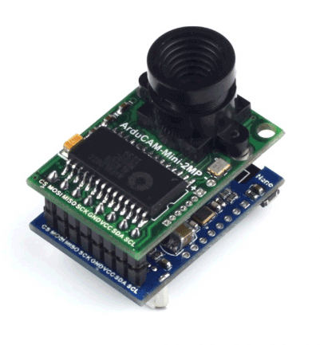

# STOP_PING
STOP_PING Captive Portal Camera for ESP8266 and ArduCAM

This projet was created for the *Stopping – Montréal* Adaptive Actions workshop organized by Jean-François Prost in collaboration with the Ellen Art Gallery: http://adaptiveactions.net/aa/stopping-montreal/

* User connects to the device broadcasting an SSID of "FREE Highspeed WiFi"
* The captive portal helper on their phone/tablet/computer kicks in and presents them with a page showing a live camera feed of the space they are in
* If they to try to visit a Website, they are redireccted to the live camera feed
* I.e. if they try to escape the space, they are redirected to it

A similar project : https://github.com/idolpx/mobile-rr

## Logging in

## Broswing to any page

## Hardware

https://www.robotshop.com/en/arducam-2mp-v2-mini-camera-shield-esp8266-nano-module.html

